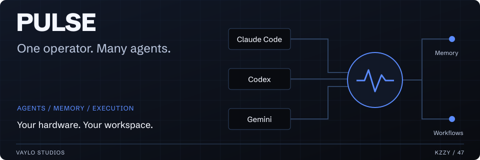
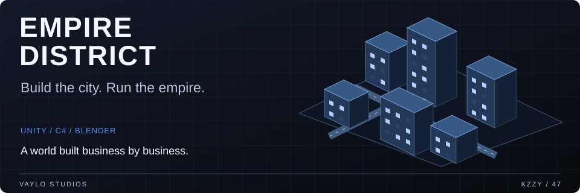
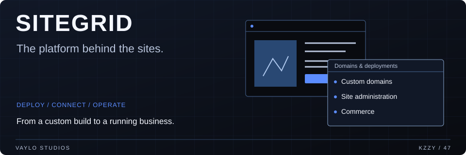

**I build the products. I build the systems that run them.**

Founder & CEO, [Vaylo Studios](https://vaylostudios.com) · President, [47 Industries](https://47industries.com)

[Studio](https://vaylostudios.com) · [Instagram](https://instagram.com/kzzy47) · [X](https://x.com/kzzy47)

 

[The flagships](#what-im-building) &nbsp; / &nbsp; [The product lineup](#apps--products) &nbsp; / &nbsp; [Client work](#built-for-businesses-too) &nbsp; / &nbsp; [The stack](#how-i-work) &nbsp; / &nbsp; [Why 47](#why-47)

---

I taught myself to build software with AI. Now I build apps, agent systems, websites, games, and the infrastructure to keep the operation moving.

Vaylo Studios is where that work lives: products of our own, software for other businesses, and the lessons I share through the Inner Circle. I'm hands-on across the whole thing, from how a screen feels to what happens behind it.

## What I'm building

### Pulse

**The system behind the operation.**

The AI operator platform I build and use to run my work. Multiple agents, shared memory, terminals, and business workflows in one workspace, with execution on your own hardware. Built across desktop, web, and mobile, with support for Claude Code, Codex, and Gemini.

| The workspace | The execution | The continuity |
| :--- | :--- | :--- |
| Agents, terminals, and projects together | Work runs on your own hardware | Shared memory and business workflows |

[Explore Pulse →](https://vaylostudios.com/pulse)

 

### Empire District

**From the skyline to the furniture inside the bar.**

A city and business simulation I'm building in Unity and C#. Procedural cities, purchasable businesses, competing owners, and a deterministic economy underneath it all. Current work reaches down to Blender-authored buildings, furnished interiors, and walking through the businesses you own. In active development.

`Procedural world` · `Business simulation` · `Editable interiors` · `Street-level exploration`

 

### SiteGrid

**The build is the beginning. The platform keeps it running.**

The platform behind the sites: deployment, custom domains, site administration, and commerce. I'm building the system alongside the businesses and storefronts it supports.

`Custom domains` · `Deployment` · `Site administration` · `Commerce`

 

### Apps & products

| Project | What I'm building it for |
| :--- | :--- |
| [MotoRev](https://motorevapp.com) | Motorcycle riders: ride tracking, group rides, a digital garage, and community. Native iOS app with an Apple Watch companion. |
| [BookFade](https://bookfade.com) | Barbers and shops: bookings, walk-ins, client management, and the daily operation. |
| [LeadSlicer](https://leadslicer.com) | Business discovery, lead qualification, and outreach. |
| [CalPal](https://calpalapp.com) | Shared calendars for couples, families, and teams. |
| Vaylo Music | Music playback, catalog management, and a native listening experience. |
| Vaylo Intel | Market data, signal research, and testing trading ideas against execution costs. |
| Veillume | A commerce brand and storefront, from product presentation to the buying experience. |

<strong>Inside the product lineup</strong>

#### MotoRev · Built around the ride

Ride tracking, group rides, a digital garage, and a rider community, with native iOS and Apple Watch experiences. The work spans the app, backend, and everything that connects riders on the road.

#### BookFade · The shop, beyond the calendar

Booking is one piece. Walk-in queues, client records, reminders, and shop management bring the day-to-day operation into the same product.

#### LeadSlicer · From discovery to outreach

Business discovery, qualification, and outreach tooling. Recent work includes the Connect agent runner and the systems behind ongoing campaigns.

#### CalPal, Music, Intel & Veillume

Shared schedules. A listening experience. Market research. A commerce brand. Different problems, with work across the product, infrastructure, and daily operation.

## Built for businesses, too

My work also includes sites and digital experiences for Coffee Rush, Highwell Group, LERTIV, Harbor Master Marine, and other local businesses. Design, mobile behavior, content, deployment, and the admin tools behind the site are all part of the build.

| Business | The work |
| :--- | :--- |
| Coffee Rush | A digital presence for a Florida coffee company |
| Highwell Group | A company site for print, production, and fabrication |
| LERTIV | Project presentation, case studies, and a company website |
| Harbor Master Marine | A marine service website with a focus on clear services and contact |

[Explore the studio's work →](https://vaylostudios.com)

I share the methods through Vaylo's Inner Circle: what I'm using, what I'm changing, and what I've learned from running the work.

## How I work

**Build it. Run it. Learn from it. Build it better.**

I use AI throughout the build: code, design, research, automation, and iteration. I care about the entire product, including the parts you only notice when they break.

Recent work moves between city interiors in Unity, domain automation in SiteGrid, product photography and storefront details, and the mobile polish on client sites. That's the range I like: the big system and the small detail.

Most of my product code lives in private repositories. The work extends well beyond what's visible on this profile.

**Tools across my projects:** TypeScript, React, Next.js, Node.js, SwiftUI, Flutter, C#, Unity, Blender, SQL, and agent orchestration.

## Why 47

47 Industries started with a 3D printer and a promise: never stop building. That promise carries Bryce Raiford's memory forward. It's still at the center of what I do.

> **Never stop building.**
>
> In memory of Bryce Raiford.

---

**Build like a giant. Live like one.**

[See the work](https://vaylostudios.com) · [About me](https://vaylostudios.com/team/kzzy)

